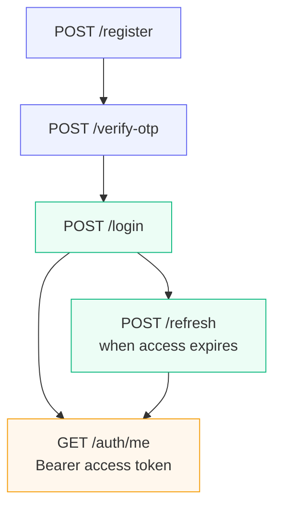

# 6.3 — What you'll build

> **[Read]** · Chapter 06 — Authentication API · *Register, login, refresh, OTP — API only*

By the end of Chapter 6, your API supports **full authentication flow via curl** — register, verify OTP, login, refresh access token, and access a protected route with Bearer token. Passwords hashed; refresh tokens stored hashed in DB.

<BigWordAlert term="Auth API module" plainEnglish="Server routes for register, login, verify OTP, refresh token — plus middleware to protect other routes." whyItMatters="FreshMarket's auth module is the security foundation every vendor and customer route builds on." />

## Why this matters for absolute beginners

This table is your **contract with Chapter 7**. Every path, status code, and token shape the React forms will call is listed here first. Building UI before these endpoints exist invites mismatch — wrong JSON field names, missing OTP step, refresh not implemented. Nail curl flow in Chapter 6; Chapter 7 becomes wiring, not redesign.

## Common beginner questions

**Q: Why `/api/auth` prefix?**  
A: To keep your routes organised as the app grows. `/api/auth` groups every authentication endpoint under one path, so `app.js` can mount them all with a single line, and it keeps them clearly separate from future route groups like `/api/products` or `/api/orders`. It also makes the API predictable to anyone reading it: anything under `/api/auth` is about identity.

**Q: Refresh in cookie or JSON body?**  
A: Either works for the curl tests in this chapter; the difference matters in the browser in Chapter 7. A JSON body is simpler to test with curl, but a browser can't easily move a token from a JSON response into a safe place. An httpOnly cookie is the more secure choice for the browser because JavaScript can't read it, so a script can't steal it. For this course: prove the flow with a body first, then move the refresh token to an httpOnly cookie when you build Chapter 7.

**Q: Is logout required for gate?**  
A: No — logging out is about revoking the refresh token, and that's not on the critical path to passing the gate. If you do add it, the meaningful part is revoking the refresh token server-side so it can't be traded for a new access token; clearing tokens on the client alone is cosmetic.

**Q: Where do User models live vs auth routes?**  
A: In separate modules, by design. The Mongoose User and Profile models live in `modules/users/` because they describe the data. The HTTP routes, validation, and token logic live in `modules/auth/` because they describe the identity workflow. That split keeps one module from growing into a pile of unrelated code — the "layer vs module" idea from Chapter 2, applied.

## API deliverables

| Method | Path | Auth | Purpose |
|---|---|---|---|
| POST | `/api/auth/register` | none | Create User + Profile; issue OTP |
| POST | `/api/auth/verify-otp` | none | Set isVerified; optional auto-login |
| POST | `/api/auth/login` | none | Email + password → tokens |
| POST | `/api/auth/refresh` | refresh cookie/body | New access token |
| POST | `/api/auth/logout` | optional | Revoke refresh — optional for gate |
| GET | `/api/auth/me` | Bearer access | Protected smoke test |

Mount prefix: `/api/auth` on Express app.

## Chapter 6 auth flow (visual)



Password hashing (6.5) and JWT structure (6.6) sit **inside** login and register — this is the route-level map Chapter 7 will wire in React.

## Module files

```
server/src/modules/auth/
├── auth.routes.js       ← wire paths to handlers
├── auth.service.js      ← business logic, bcrypt, JWT
├── auth.middleware.js   ← requireAuth
└── auth.schema.js       ← validate req.body shapes
```

**No auth.model.js** — User/Profile in users module.

## Middleware deliverable

`requireAuth` — reads `Authorization: Bearer <accessToken>`, verifies JWT, attaches `req.user = { id, role }`, returns **401** if missing/invalid/expired.

Used on `/api/auth/me` this chapter; store/product routes in later chapters.

## Token contract

| Token | Lifetime | Storage (API response) | Payload |
|---|---|---|---|
| Access | short (15m) | JSON body | userId, role |
| Refresh | long (7d) | httpOnly cookie **or** body for curl-only phase | userId + jti |

**Course allows refresh in JSON body for 6.18 curl tests** — Chapter 7 moves refresh to httpOnly cookie.

Document both phases in README.

## User model extensions (if needed)

May add to User schema during Ch 6:

| Field | Purpose |
|---|---|
| `otpHash` or `otpCode` + `otpExpiresAt` | Verification |
| `refreshTokenHash` | Already spec'd in Ch 5 |

Update `docs/erd.md` if fields added — small diff commit.

## Environment variables

Add to `server/.env.example`:

```env
JWT_SECRET=change-me-in-production-use-long-random-string
JWT_ACCESS_EXPIRY=15m
JWT_REFRESH_EXPIRY=7d
```

Validation in `config.js` — JWT_SECRET required at startup (fail fast like MONGODB_URI).

<MandatoryReadCard
  title="JSON Web Token introduction"
  href="https://jwt.io/introduction"
  source="Auth0 / JWT.io"
  summary="Clear explanation of JWT structure, signing, and why tokens are used in stateless APIs. Read before implementing access and refresh tokens."
  readMinutes={8}
/>

<RealWorldEvent title="Auth0 breach response reshapes token hygiene" when="2023" summary="High-profile auth incidents pushed teams to shorten token lifetimes, rotate secrets, and treat refresh flows as first-class security surfaces." lesson="Build OTP verification and refresh rotation now so auth is production-shaped before real customer data exists." />

## Dependencies

```json
"bcrypt": "^5.x",
"jsonwebtoken": "^9.x"
```

Optional: `cookie-parser` if setting refresh cookie in Ch 6 — else defer to Ch 7.

HTTP validation: use existing pattern or Zod/Joi in auth.schema.js — your choice.

## curl verification script (6.18)

End-to-end:

1. Register vendor  
2. Verify OTP  
3. Login → access + refresh  
4. GET /api/auth/me with Bearer  
5. Login unverified user → 403  
6. Wrong password → 401  

## What you will NOT build

- React login form — Ch 7  
- `requireRole('vendor')` — Ch 8  
- Email SMTP — console OTP only  
- Rate limiting — stretch  
- Password reset — out of scope  

## ✅ Do / ❌ Don't

**✅ Do:** Return consistent error JSON `{ message, code? }` — client maps in Ch 7.

**✅ Do:** Never include passwordHash in any response.

**❌ Don't:** Use same secret as tutorial copy-paste — generate local JWT_SECRET.

**❌ Don't:** Skip OTP — Ch 7 VerifyOtp page depends on it.

## Next

**Sub-chapter 6.4:** Sessions vs JWT — stateful vs stateless; course picks JWT.

API surface defined — architectural choice next.
<InterestingRead title="Refresh tokens: why one token is not enough" hook="Short access tokens limit damage; refresh tokens limit annoyance." readMinutes={5}>

If access tokens lived for weeks, a stolen token would stay valid for weeks. If they expired every minute, users would log in constantly. FreshMarket uses brief access tokens plus longer refresh tokens — a pattern you will wire on both server and client.

</InterestingRead>
