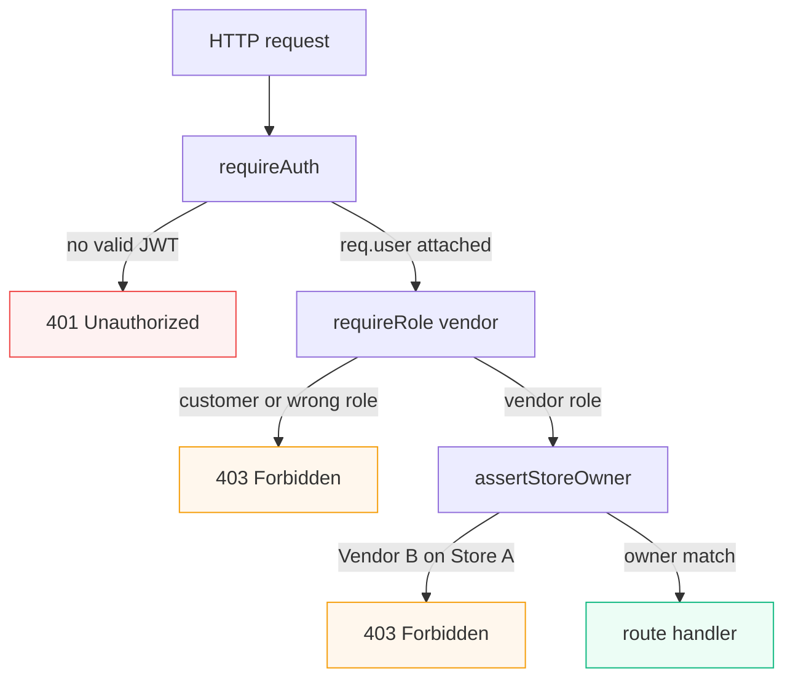
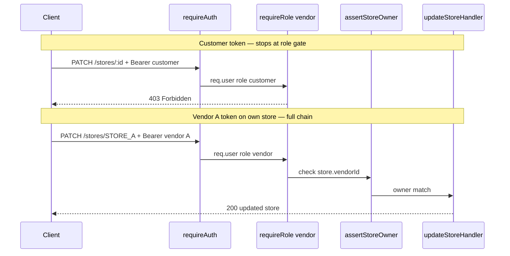
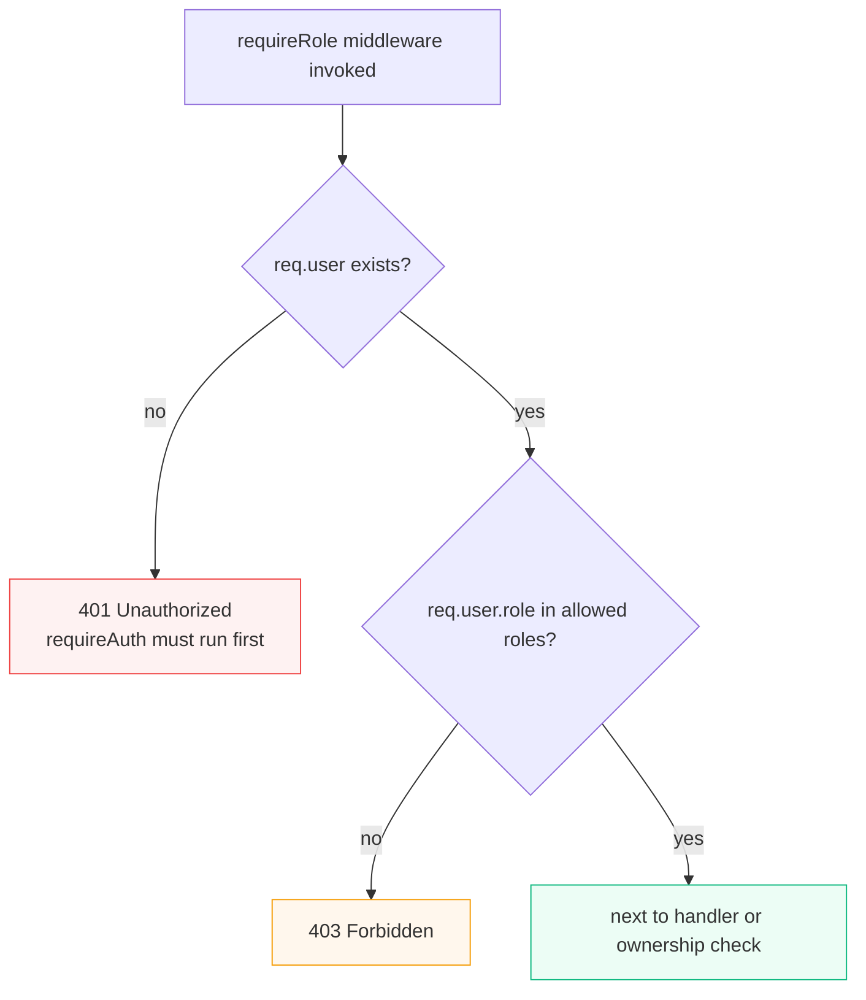

# 8.10 — Require role middleware

> **[Build]** · Chapter 08 — Authorization & isolation · *`requireRole('vendor')` — 403 for wrong role*

**Why this step matters:** `requireAuth` tells you *who* called the API; `requireRole` tells you *what kind of user* they are. Without it, a customer token could hit vendor-only routes. This middleware is reused on every vendor feature through Week 2 — get the factory pattern right once.

<BigWordAlert term="Role middleware" plainEnglish="Express middleware that returns 403 if the user's role is not in the allowed list." whyItMatters="FreshMarket vendor routes chain `authenticate` then `requireRole('vendor')` before handlers run." />

**Where the project is now:** requireAuth attaches req.user; routes do not check role.

**After this step:** `requireRole(...roles)` returns **403** when authenticated user's role not in allowed list; passes through when match.

## Why middleware order is not optional

Authorization is a **stack of gates**. Each gate answers a different question. Skip or reorder one and the wrong user reaches your handler.





<Callout type="warning" title="Customer token must stop at requireRole">
If a customer reaches `assertStoreOwner`, you still blocked them — but you wasted a database read. More importantly, if you **skip** requireRole, a customer token could hit vendor-only logic paths you add later. Always: auth → role → ownership.
</Callout>

## Function contract

```
requireRole('vendor')
requireRole('customer')
requireRole('vendor', 'customer')  // either
```

**Factory pattern** — returns Express middleware function.

## requireRole decision logic



## Behaviour specification

| Condition | Status | Body |
|---|---|---|
| !req.user | 401 | Unauthorized — requireAuth should run first |
| req.user.role not in allowed | 403 | `{ message: 'Forbidden' }` |
| role matches | next() | |

**Order:** Always `requireAuth` before `requireRole`.

## Usage example (stores.routes.js preview)

```
router.patch('/:id',
  requireAuth,
  requireRole('vendor'),
  assertStoreOwnerMiddleware,
  updateStoreHandler
)
```

Customer token stops at requireRole — never hits ownership DB read.

<TraceRequest title="Customer token on vendor PATCH">
  <TraceStep actor="Client" label="PATCH /api/stores/:id" detail="Bearer customer token" />
  <TraceStep actor="API" label="requireAuth — req.user attached" />
  <TraceStep actor="API" label="requireRole('vendor')" status={403} detail="role customer not in allowed list" />
</TraceRequest>

```predict
prompt: A customer sends PATCH /api/stores/STORE_ID with a valid Bearer token. requireAuth and requireRole('vendor') are mounted. What status code should they receive?
options:
  - id: "403"
    label: "403 Forbidden"
  - id: "401"
    label: "401 Unauthorized"
correctOptionId: "403"
explanation: "requireAuth succeeds because the token is valid, but requireRole returns 403 because the authenticated customer lacks the vendor role."
allowRetry: true
context:
  method: PATCH
  url: /api/stores/:id
  bearer: customer-token
  responseHint: Token is valid — question is about role, not authentication.
```

## Middleware order — non-negotiable

Same stack as above — **auth → role → ownership → handler**. Wrong order causes crashes or IDOR holes.

<Callout type="warning" title="Order matters">
If you run `requireRole` before `requireAuth`, unauthenticated requests may crash on `req.user.role` or leak wrong status codes. If you skip ownership and only check role, **any vendor** can edit **any store** — the IDOR bug Chapter 8 exists to prevent.
</Callout>

## Role source of truth

Role from **JWT payload** verified by requireAuth — not from request body.

If user role changes in DB, access token stale until refresh — acceptable for MVP; note in learning log.

## curl tests

<ApiRequestPanel title="Role guard — who stops where">

<ApiRequest
  label="No token — stops at requireAuth"
  method="PATCH"
  url="http://localhost:5000/api/stores/STORE_ID"
  body='{"name":"Hack"}'
  responseStatus={401}
  responseBody='{"message":"Unauthorized"}'
/>

<ApiRequest
  label="Customer token on vendor-only PATCH (after 8.12 mount)"
  method="PATCH"
  url="http://localhost:5000/api/stores/STORE_ID"
  bearer="$CUSTOMER_TOKEN"
  body='{"name":"Hack"}'
  responseStatus={403}
  responseBody='{"message":"Forbidden"}'
/>

<ApiRequest
  label="Vendor token — passes requireRole (ownership checked in 8.11)"
  method="PATCH"
  url="http://localhost:5000/api/stores/STORE_A_ID"
  bearer="$VENDOR_A_TOKEN"
  body='{"name":"Vendor A Updated Market"}'
  responseStatus={200}
  responseBody='{"_id":"STORE_A_ID","name":"Vendor A Updated Market"}'
/>

</ApiRequestPanel>

Before 8.12 — unit test middleware in isolation or temporary test route — remove test route before gate.

## Common mistakes

| Mistake | Symptom | Fix |
|---|---|---|
| requireRole before requireAuth | req.user undefined → crash or wrong 401 | Always auth first |
| Role from request body | Attacker sends `role: vendor` | Role from verified JWT only |
| 401 for wrong role | Client refresh loop on forbidden action | Wrong role = **403**, not 401 |
| Typo `'vender'` in requireRole | Everyone gets 403 | Match User schema enum exactly |
| Single global requireRole on app | Health and register break | Apply per-route or per-router |

## File location

Add to `auth.middleware.js` or create `shared/authorization.js` — export requireRole.

Document import path in AUTHORIZATION.md.

## Commit

```bash
git add server/src/modules/auth/ server/src/shared/
git commit -m "feat(auth): add requireRole middleware"
```

## ✅ Do / ❌ Don't

**✅ Do:** Variadic roles — spread ...roles.

**✅ Do:** 403 message generic — don't leak which role required if paranoid; OK for learning.

**❌ Don't:** Check role before authentication.

**❌ Don't:** Hardcode role string typos — use constants optional.

## Verify checklist

- [ ] Vendor role passes requireRole('vendor')
- [ ] Customer role fails requireRole('vendor') with 403
- [ ] Missing req.user returns 401
- [ ] Documented in AUTHORIZATION.md

<RealWorldEvent title="Facebook Graph API permission scandals" when="2010s" summary="Platforms exposed user data when apps could request broader permissions than users understood — driving industry focus on least-privilege access." lesson="Centralize authorization in middleware and guards. Ad-hoc checks in individual routes drift and get missed during code review." />

## Next

**Sub-chapter 8.11:** assertStoreOwner ownership helper.

Role guard done — object ownership next.
