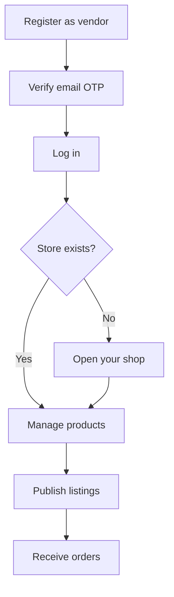
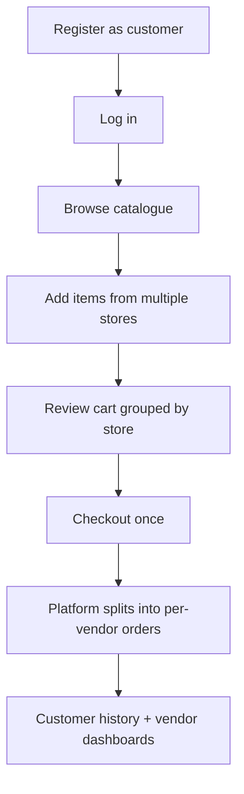
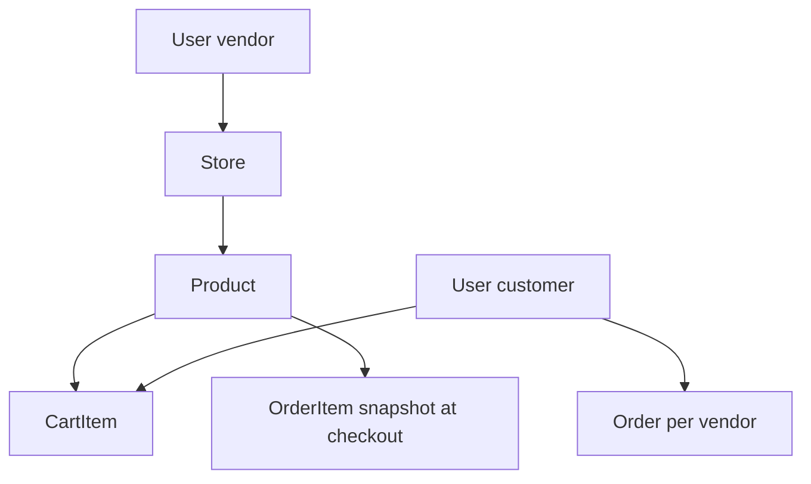

<Callout type="info" title="What you'll learn">
Before you meet the vendors and customers, meet the **product** — the thing you're building, described the way a user would experience it, not the way a system diagram would decompose it.
</Callout>

<BigWordAlert term="Marketplace actors" plainEnglish="The distinct roles in a marketplace — shoppers, vendors, and the platform operator — each with different permissions." whyItMatters="FreshMarket's auth, dashboards, and order flows all map back to who is logged in and what they can touch." />

Imagine a Saturday morning. Someone opens your app on their phone. They're buying from **every local shop in the neighbourhood**, in one session — rice from Ali's Grocer, coriander from Green Valley Farm, oil from The Pantry. One cart. One checkout. Behind that button, your platform splits the purchase into **three separate orders**, notifies each shop, and locks the prices on each receipt.

## The product in one sentence

**A local grocery marketplace where independent shops sell through one platform, customers shop across all of them in a single cart and checkout, and every vendor sees only their own business.**

Name it yourself. The course cares about behaviour and structure, not your exact shade of green.

## Why "local grocery" is a deliberate choice

**Units matter** — kg, pieces, litres. **Stock can be decimal.** **Perishables** are a first-class flag. **Photos are load-bearing.** **Multi-vendor cart** is the architectural heart. If you swapped "grocery" for "generic goods" and nothing in the schema changed, the domain would be a label, not a design force.

## The two actors

### The vendor — a local shop owner

Independent seller using your marketplace. They register, open **one store**, manage **their own products**, upload photos, and see **only their orders**. They must never view or edit another vendor's data.

### The customer — a shopper

They browse the full catalogue, search and filter, add items from **multiple vendors** to **one cart**, check out once, and see order history with **frozen prices**.

## There is no platform admin in this course

Admin panels are **out of scope**. The course focuses on vendor isolation and customer commerce — where the hard engineering lives.

## How the two actors meet — the core flows

### Flow 1 — Vendor onboarding

### Flow 2 — Customer purchase

### Flow 3 — Price change after purchase

1. Customer bought 1 kg rice at **₹80** last Tuesday
2. Vendor updates rice to **₹95** this Monday
3. Customer opens order history

**Correct:** Order history still shows **₹80** — snapshotted at checkout.

**Wrong:** Order history shows **₹95** — order line only stored `productId`.

## Roles — one account, one role

The permission split below is the seed of everything you'll build — who can do what in the marketplace:

| Action | Customer | Vendor |
|---|---|---|
| Browse public catalogue | ✓ | ✓ |
| Manage own cart & checkout | ✓ | ✓ |
| Create / edit products | ✗ | ✓ (own only) |
| Open a store | ✗ | ✓ (one store) |
| View vendor order dashboard | ✗ | ✓ (own orders only) |

**Authentication** = who is calling. **Authorization** = what they're allowed to do.

## The ownership chain — preview

## Grocery-specific product shape — preview

Grocery forces fields a generic shop wouldn't need — here's the shape you'll model in Chapter 5:

| Field | Example | Why |
|---|---|---|
| `unit` | kg / piece | Grocery sells by measure |
| `stockQty` | 45.5 | Decimal stock |
| `isPerishable` | true/false | Domain flag |
| `imageUrl` | Cloudinary URL | Photo, not blob |
| `storeId` | ref → Store | Ownership |

## What the product is not

Not a delivery tracker, review site, chat app, or admin SaaS. Those exclusions keep four weeks focused on **identity, isolation, catalogue, cart, checkout, deploy**.

## Picture the finished demo

**Minute one — vendor:** Log in → create product with photo → see it in the table.

**Minute two — customer:** Browse → add from two vendors → checkout → two orders → change vendor price → customer history unchanged.

<RealWorldEvent title="Instacart scales local grocery delivery" when="2012–present" summary="Instacart connected independent grocery stores to shoppers through a single app, handling inventory sync, delivery logistics, and multi-store baskets at national scale." lesson="Your FreshMarket build starts smaller, but the same pattern applies: one customer experience, many vendor backends, and careful data ownership." />

## Key ideas from this page

- **Local grocery marketplace** — one cart, many vendors, split checkout
- **Two actors:** vendor (back office) and customer (shop front)
- **Ownership chain:** User → Store → Product → Cart / Order
- **Price snapshots** protect order history

Next: the explicit scope list — what's in, what's out.
## Before you continue

<OpenQuestion id="01M34MR7YR38GN4Z6EQZ36QVX9" />
