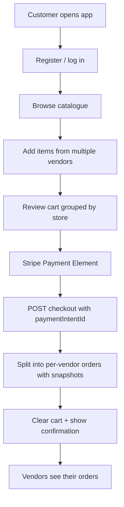
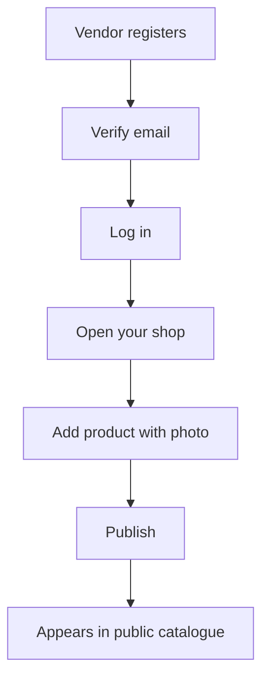

<BigWordAlert term="MVP scope" plainEnglish="The smallest version of a product that delivers real value — and deliberately leaves polish for later." whyItMatters="This course ships a working grocery marketplace, not every feature Amazon has — scope keeps you shipping." />

## What "scope" means

**In scope** means features you **must build and demo** to finish this course. They appear in a chapter, have a gate checklist, and count toward your finished marketplace.

**Out of scope** means features you **deliberately do not build** during these four weeks — even if they sound impressive. Skipping them keeps you focused on auth, isolation, catalogue, cart, checkout, and deploy.

Think of scope as a contract: if it is in scope, you ship it; if it is out of scope, you do not spend a week on it instead of checkout.

Scope is a contract between you and the course. **In scope** is what you must ship to finish. **Out of scope** is what you must not spend four weeks building instead — even if it sounds impressive on LinkedIn.

Getting this wrong is how projects die at week three: you add Stripe, then webhooks, then an admin dashboard, then realise checkout still does not split by vendor. The exclusions below are not limitations — they are **focus**.

## In scope — what you must build

Everything below appears in a chapter with a checklist gate. If it's on this list, it ships.

### Identity & access

Every account flows through the same auth system — who can register, how they prove who they are, and what they're allowed to touch:

- **Vendor registration** — email, password, role `vendor`
- **Customer registration** — email, password, role `customer`
- **Email verification (OTP)** — account inactive until verified; console-log OTP is acceptable (real email delivery is bar-raiser territory)
- **Login & logout** — access token (JWT) + refresh token (hashed in database, revocable)
- **Password security** — bcrypt (or equivalent); no readable passwords in MongoDB
- **Role-based access** — vendor routes reject customers; customer routes reject unauthenticated users
- **Ownership enforcement** — vendor cannot read/write another vendor's store or products (403 or 404)

### Vendor experience

Everything a shop owner needs to run their side of the marketplace:

- **Store profile** — name, description, address, logo URL; one store per vendor
- **Product CRUD** — create, read, update, delete own products only
- **Grocery product fields** — price, unit (`kg` / `g` / `litre` / `piece`), weightOrQuantity, stockQty, isPerishable, category
- **Product images** — upload to Cloudinary (or S3); store URL in MongoDB only
- **Vendor product dashboard (UI)** — list, create, edit, publish/unpublish
- **Vendor order view** — see orders for own store only; update fulfilment status (e.g. pending → packed → dispatched)
- **Onboarding gate** — vendor without a store is routed to "open your shop" before product management

### Customer experience

Everything a shopper does, from window-shopping to a split checkout:

- **Public catalogue API** — all published in-stock products; category filter; store filter; pagination
- **Search** — text search on product name/category with MongoDB text index
- **Shop UI** — product grid, filters, pagination, product detail page
- **Multi-vendor cart** — persisted in database; scoped to logged-in customer; items carry store reference
- **Cart UI** — grouped by store; quantity update; remove item
- **Single-step checkout** — one action splits cart into **one Order document per vendor**
- **Price snapshots** — each order line embeds priceAtPurchase, nameAtPurchase, unitAtPurchase at checkout time
- **Stock decrement** — atomic on checkout; reject if any item out of stock
- **Customer order history (UI)** — all orders, snapshot prices, status
- **N+1 avoidance** — catalogue and order lists use populate/batch patterns; query count verified

### Platform & production

The infrastructure decisions that make the product real — structure, config, performance, and deployment:

- **Project structure** — `server/` + `client/` in one repo; module-based folders mandated
- **Configuration** — secrets and connection strings from environment variables; `.env` git-ignored; `.env.example` committed
- **Health check** — `GET /health` returns 200; extended with DB status after connection
- **Seed script** — at least two vendors, two stores, multiple products, two customers
- **ERD & docs** — entity-relationship diagram committed; architecture sketch by end of course
- **Redis catalogue cache** — cache public catalogue reads; invalidate on product write
- **Redis job queue (BullMQ)** — async notifications after paid checkout and order status changes; separate worker process
- **Deployment** — live HTTPS URL for API, client, and worker; processes survive restart
- **Payment processing (Stripe)** — Payment Intents in test mode; Stripe Elements on checkout UI; webhook handler; `paymentStatus: paid` on successful checkout; `stripePaymentIntentId` on orders

## Out of scope — what you must not build (in the core course)

These are deliberate. If you find yourself building them, stop and return to the checklist of the chapter you're on.

| Excluded | Why it's out | What we do instead |
|---|---|---|
| **Stripe Connect / vendor payouts** | Marketplace payout splits are a separate integration | Platform collects one payment per checkout; vendors see orders, not payout rails |
| **Shipping & logistics** | Carrier APIs, tracking numbers, delivery zones | Fulfilment status field on order; no courier integration |
| **Admin panel** | Platform operator features distract from vendor/customer isolation | No admin role in core scope; optional bar-raiser |
| **Reviews & ratings** | Social layer is a separate product | None |
| **Real-time features** (WebSockets, live push UI) | Not needed to prove marketplace correctness | Async jobs + console/mock notify; polling or manual refresh is fine |
| **Email delivery infrastructure** | OTP and order notify use mock/console in core course | Worker logs `[NOTIFY]`; bar-raiser: SendGrid/Resend |
| **Mobile native apps** | React web UI is the client | Responsive web is enough |
| **Multi-language / i18n** | Scope creep | English UI only |
| **Advanced analytics** | Revenue dashboards, charts | Vendor sees their orders; no charts required |
| **Inventory / ERP systems** | Stock replenishment, supplier POs, warehouse bins | Simple `stockQty` on product + atomic decrement at checkout only |
| **Kafka / multi-service event bus** | Out of medium MERN scope | **Redis + BullMQ job queue** in Chapter 22 — same monorepo, worker process |

**The test for "should I add this?"** If it doesn't appear in the **In scope** list above and isn't your **bar-raiser** (final creative extension), it waits until after the course — or never.

## The bar-raiser — the one exception

The closing chapter invites you to add **one creative extension** that doesn't break core rules:

- Data isolation must still hold — one vendor never sees another's data
- Order snapshots must still hold — old orders don't rewrite prices
- Secrets still live in env vars, not Git

Examples that fit:

- Real email delivery for OTP
- Perishable-only delivery slot picker
- Vendor sales summary (their data only)
- Minimum order quantity per store

Examples that don't fit as a substitute for core scope:

- "I added Stripe Connect instead of checkout" — split checkout was the point
- "I added admin panel instead of vendor dashboard" — wrong actor

The bar-raiser is **one line in the closing chapter** plus whatever you build — not a replacement for weeks 1–3.

## User flows — the script the course implements

### Primary flow — customer purchase (end-to-end)

This flow must work in the **browser** at the end of Week 3 — not only via curl.

### Primary flow — vendor stocking a shop

This flow must work in the **browser** at the end of Week 2.

### Secondary flow — isolation attack (you must test this)

Vendor A creates product P. Vendor B sends PATCH on P with their token → **403 or 404**, never success. Same for another vendor's store.

### Secondary flow — snapshot immutability (you must test this)

Customer checks out at ₹100. Vendor updates price to ₹150. Order history must still show **₹100**.

## API surface — preview (not exhaustive)

Scope includes a REST API roughly shaped as:

| Area | Example routes | Auth |
|---|---|---|
| Health | `GET /health` | Public |
| Auth | `POST /auth/register`, `/login`, `/refresh`, `/verify-otp` | Public / token |
| Stores | `POST /stores`, `GET /stores/me`, `PATCH /stores/:id` | Vendor |
| Products (vendor) | `POST /products`, `GET /vendor/products`, `PATCH/DELETE /products/:id` | Vendor + ownership |
| Products (public) | `GET /products`, `GET /products/:id` | Public |
| Cart | `GET /cart`, `POST /cart`, `PATCH/DELETE /cart/:itemId` | Customer |
| Payments | `POST /payments/intent` | Customer |
| Checkout | `POST /checkout` (requires `paymentIntentId`) | Customer |
| Webhooks | `POST /webhooks/stripe` | Stripe signature |
| Orders | `GET /orders/my`, `GET /vendor/orders`, `PATCH /vendor/orders/:id/status` | Customer / vendor |

Exact paths may vary in your implementation — the **behaviours** are fixed.

## UI surface — preview

The screens you'll ship, who they're for, and whether they're in scope:

| Screen | Actor | In scope |
|---|---|---|
| Home / shop browse | Customer | ✓ |
| Product detail | Customer | ✓ |
| Cart | Customer | ✓ |
| Checkout (review + payment form) | Customer | ✓ |
| Checkout confirmation | Customer | ✓ |
| Order history | Customer | ✓ |
| Register / login / verify OTP | Both | ✓ |
| Open your shop | Vendor | ✓ |
| Vendor product table | Vendor | ✓ |
| Create / edit product | Vendor | ✓ |
| Vendor orders | Vendor | ✓ |
| Admin dashboard | — | ✗ |

## Documentation deliverables — in scope

By the end of the course (closing chapter), you also ship:

- **ERD** — collections, refs, embedded order lines
- **Architecture diagram** — client → API → MongoDB, Redis (cache + queue), worker, Cloudinary
- **User flow sketches** — vendor onboarding + customer checkout (paper, Excalidraw, or Mermaid)
- **`CHALLENGES.md`** (or README section) — two or three honest paragraphs on what broke and how you fixed it
- **Demo video** — two to three minutes, both actor flows
- **Portfolio / case study** — one technical decision explained in depth (snapshots, isolation, or N+1 — your pick)

These are not optional extras. They're how you prove the project is yours.

## Scope by week — what "done" means each week

| Week | Minimum scope complete | Demo |
|---|---|---|
| 1 | Skeleton, MongoDB, models, seed | Health in browser; Compass shows seed data |
| 2 | Auth, isolation, vendor store, products, photos, vendor UI | Vendor adds product with photo in dashboard |
| 3 | Catalogue, cart, checkout, payment, order UIs | Customer pays with Stripe test card → two orders if two vendors in cart |
| 4 | Cache, search, deploy | Public HTTPS URL; cache invalidation shown |

If a week ends without its demo, you are **not scope-complete** for that week — regardless of how many chapters you read.

## Common scope mistakes — avoid these

**Mistake 1 — Payment before checkout logic.** Integrating Stripe before checkout splits correctly builds a payment flow on a broken order model. Checkout and snapshots first (Ch 18); Stripe gate second (Ch 19).

**Mistake 2 — Admin first.** Building a "super user" who sees everything teaches the opposite of vendor isolation. Vendors see only their slice — that's the hard part.

**Mistake 3 — Polish before core.** Beautiful CSS before auth works is backwards. The course pairs UI chapters immediately after API chapters — but the API must exist first.

**Mistake 4 — Concept hoarding.** Reading about normalization for three days without a schema is out of balance. Week 1 builds the model; Week 3 names the snapshot pattern when checkout demands it.

**Mistake 5 — Scope smuggling via bar-raiser.** "My bar-raiser is a full admin panel" skips the vendor/customer work. The bar-raiser is one extension, not a replacement.

<RealWorldEvent title="Instacart scales local grocery delivery" when="2012–present" summary="Instacart connected independent grocery stores to shoppers through a single app, handling inventory sync, delivery logistics, and multi-store baskets at national scale." lesson="Your FreshMarket build starts smaller, but the same pattern applies: one customer experience, many vendor backends, and careful data ownership." />

## Key ideas from this page

- **In scope** is the contract — identity, isolation, vendor tools, customer commerce, Stripe payments, cache, deploy
- **Out of scope** protects focus — no Connect payouts, admin, reviews, or real-time in the core course
- **Two primary flows** — vendor stocks shop; customer checks out across vendors — both demoable in UI
- **Two test flows** — isolation attack fails; snapshot immutability holds
- **Weekly demos** define progress — not pages read

Next: prerequisites — what you should already be comfortable with before Chapter 2.
## Before you continue

<OpenQuestion id="01KZP7KNPJT006H8N3XTGSENSP" />
