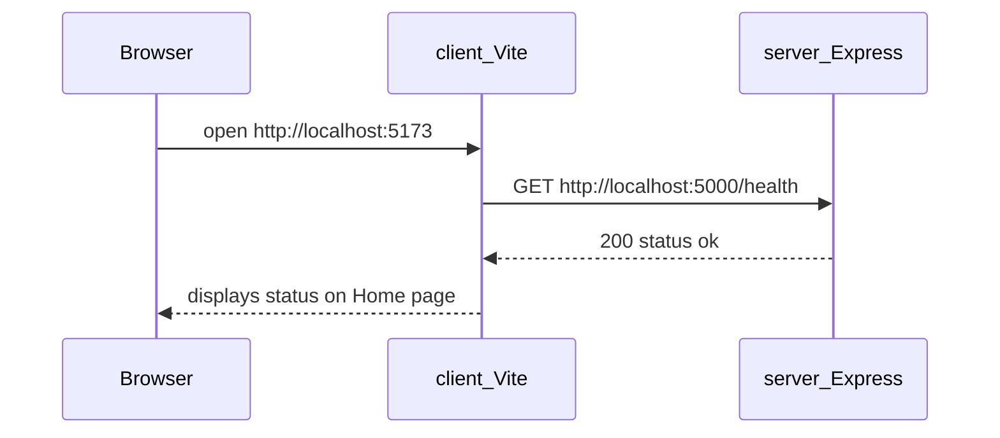

This sub-chapter is the blueprint. No code yet — just the **tree** you'll grow over the next twelve build steps. Read it once now; return after 2.16 and confirm your repo matches.

<BigWordAlert term="Full-stack skeleton" plainEnglish="A minimal client plus server that talk over HTTP — no database yet, but the wiring is real." whyItMatters="Chapter 2's deliverable is proof that React and Express can handshake before you add MongoDB or auth." />

## Why this matters for absolute beginners

Staring at a blank folder is overwhelming. This tree is your **map** — not a dump of every file you create today, but the destination after sub-chapters 2.8–2.16. When a step says "create `client/src/api/client.js`," you already know that file sits under `client/`, not inside `server/`. When Chapter 6 says auth routes live in `modules/auth/`, you see that folder was a placeholder you created on purpose. Blueprint first prevents improvising paths that diverge from the course.

## Common beginner questions

<FaqGroup>

<FaqItem question={"Do I create this entire tree in one command?"}>

No — and that's on purpose. The build sub-chapters (2.8–2.16) add pieces incrementally, so after every step you know exactly what changed and why. If you scaffolded everything at once, you'd end up with a folder you can't explain. Empty module folders get `.gitkeep` files so Git tracks them; otherwise Git ignores empty directories and the placeholder silently vanishes. Think of the tree as the blueprint: you're not raising the whole market hall in one swing — you're laying one brick per step and checking each one.

</FaqItem>

<FaqItem question={"Why is `shared/` separate from `modules/`?"}>

Because `shared/` holds cross-cutting infrastructure that every module needs — config, database connection, shared error helpers — while `modules/` holds one product feature each. `auth/` is about logging in and `products/` is about listing groceries, but `db.js` isn't about any single feature; it's the water supply all the stalls share. If the database setup lived inside, say, `products/`, then auth and orders would have to import from an unrelated folder. Keeping shared code in one obvious place stops modules from reaching into each other's business.

</FaqItem>

<FaqItem question={"What's the difference between `app.js` and `server.js`?"}>

`app.js` **builds** the Express application — it creates the app, registers middleware like JSON parsing and CORS, and mounts routes. `server.js` **starts it** — it imports the app, reads `PORT`, and calls `app.listen()`. The split pays off later: tests can import `app` and send fake HTTP requests without opening a real port. It's the difference between preparing the kitchen and unlocking the doors for customers. One extra file now saves you from a refactor when testing arrives.

</FaqItem>

<FaqItem question={"Why show empty auth/cart/orders folders now?"}>

They're placeholders — labeled empty shelves in a shop that isn't stocked yet. Their job is to remind you where future code lands: Chapters 5–18 create files *inside* those folders, and when a step says "create `modules/auth/auth.routes.js`," you already know the folder exists and why. Seeing the destination first also stops you from improvising paths as you go, which is how repos drift away from the guide. Empty folders are cheap; an unplanned `authStuff/` next to a planned `auth/` is confusing forever.

</FaqItem>

<FaqItem question={"Why is `.env` git-ignored but `.env.example` committed?"}>

Because `.env` holds secrets — database URLs, JWT secrets, API keys — and committing them leaks them to anyone who can read your repository. `.env.example`, by contrast, holds only the *names* of the variables with dummy values, like `PORT=5000` or `MONGODB_URI=`. It's the "here's what you need to set" cheat sheet for anyone cloning your project. The rule is: commit the shape, never the secrets. It looks like housekeeping, but it prevents real-world disasters.

</FaqItem>

</FaqGroup>


<ArchitectureDiagram title="Request path at end of Chapter 2">
  <ArchNode layer="Client">React / Vite — Home page calls health API</ArchNode>
  <ArchNode layer="API">Express — `/api/health` returns JSON</ArchNode>
  <ArchNode layer="Data">No database yet — static `{ status: 'ok' }`</ArchNode>
</ArchitectureDiagram>

## The repository at the end of Chapter 2

```
your-marketplace/                 ← root (name yours: GreenBasket, FreshMarket, …)
├── README.md                     ← how to run server + client
├── .gitignore                    ← node_modules, .env, build output
│   ├── 01-introduction.md
│   └── 02-project-skeleton.md    ← you'll add this at the gate
├── docs/                         ← empty for now; ERD comes Chapter 5
│
├── server/
│   ├── package.json
│   ├── .env                      ← git-ignored; may be empty until Ch 4
│   └── src/
│       ├── server.js             ← entry: starts listening
│       ├── app.js                ← builds Express app; mounts routes
│       ├── shared/               ← cross-cutting utilities (later: config, db)
│       │   └── .gitkeep
│       └── modules/              ← one folder per domain (mostly empty today)
│           ├── auth/
│           ├── stores/
│           ├── products/
│           ├── cart/
│           └── orders/
│
└── client/
    ├── package.json
    ├── vite.config.js
    ├── index.html
    ├── .env                      ← VITE_API_URL (git-ignored)
    └── src/
        ├── main.jsx              ← React entry
        ├── App.jsx               ← router shell
        ├── pages/
        │   └── Home.jsx          ← fetches /health, displays JSON
        ├── components/           ← empty; shared UI later
        ├── api/
        │   └── client.js         ← base URL + fetch wrapper
        └── hooks/                ← empty; useAuth later
```

That's the **target**. You won't create every folder in one command — build sub-chapters add them step by step so you always know what changed.

## Server responsibilities after Chapter 2

| Piece | File / folder | After Ch 2 |
|---|---|---|
| HTTP server | `server.js` | Listens on `PORT` (default 5000) |
| Express app | `app.js` | JSON middleware, CORS, routes mounted |
| Health check | route in `app.js` or `shared/` | `GET /health` → 200 + JSON body |
| Domain modules | `modules/*/` | Empty placeholders — files arrive Ch 5–18 |
| Shared infra | `shared/` | Empty — `config.js`, `db.js` in Ch 4 |

**Not yet on server:** MongoDB, auth, validation library, file upload.

## Client responsibilities after Chapter 2

| Piece | File / folder | After Ch 2 |
|---|---|---|
| Dev server | Vite | Serves React on port 5173 (default) |
| Routing | `App.jsx` | Route `/` → Home |
| Home page | `pages/Home.jsx` | Calls API health; shows status |
| API helper | `api/client.js` | Prefixes `VITE_API_URL` on requests |
| Pages / components | folders exist | Vendor & shop pages come Weeks 2–3 |

**Not yet on client:** login, cart, dashboard styling beyond minimal.

## The first end-to-end demo



**Screenshot moment:** Browser showing `status: ok` (or your JSON) fetched from *your* API — not hardcoded in React. That proves:

- CORS configured (browser allows cross-origin to API)
- API URL env var correct on client
- Both processes running

## npm scripts you'll have

**Server (`server/package.json`):**

| Script | Purpose |
|---|---|
| `dev` | Start API with auto-reload on file changes |
| `start` | Start API for production-style run (same for now) |

**Client (`client/package.json`):**

| Script | Purpose |
|---|---|
| `dev` | Vite dev server |
| `build` | Production bundle (used Chapter 23) |
| `preview` | Preview production build locally |

Exact script commands appear in sub-chapters 2.10 and 2.12 — you'll copy the **tooling** blocks from the course (allowed); you wire them into your project.

<MandatoryReadCard
  title="Introduction to client-side JavaScript frameworks"
  href="https://developer.mozilla.org/en-US/docs/Learn_web_development/Core/Frameworks_libraries/Introduction"
  source="MDN"
  summary="Short MDN primer on why frameworks like React exist and what problems they solve. Helps you understand why the client is a separate app from Express."
  readMinutes={12}
/>

<RealWorldEvent title="Shopify's modular commerce platform" when="2006–present" summary="Shopify grew from a single-product store builder into a platform with separate admin, storefront, and API surfaces — all coordinated through clear project boundaries." lesson="Starting with a deliberate folder skeleton prevents painful renames later when vendor, cart, and payment code all need room to grow." />

## Environment variables introduced this chapter

| Variable | Where | Example | Secret? |
|---|---|---|---|
| `PORT` | server | `5000` | No |
| `VITE_API_URL` | client | `http://localhost:5000` | No |

No database URL yet. No JWT secret yet. When those arrive (Chapter 4+), they live in **`server/.env` only** — never in the React bundle unless prefixed for public config (and secrets are never public).

## Definition of Done — preview

Chapter 2 checklist (full list in 2.19) requires:

- [ ] Git repo initialized; sensible `.gitignore`; first commits  
- [ ] Server starts; `curl localhost:5000/health` returns 200 JSON  
- [ ] Client starts; Home page loads  
- [ ] Home page shows health response from API (not fake static text)  
- [ ] Folder tree matches module-based convention  
- [ ] Learning log `02-project-skeleton.md` written  

## What you'll explain in the viva (eventually)

After this chapter, you should answer without notes:

1. Why `app.js` and `server.js` are separate files  
2. What lives in `modules/` vs `shared/`  
3. Why the client has `api/client.js` instead of fetch URLs scattered in components  
4. Why `.env` is git-ignored but `.env.example` (later) is committed  

## Pace through build steps

| Sub-chapter | You'll create |
|---|---|
| 2.8 | Root repo, `.gitignore`, `README` |
| 2.9 | Server folder skeleton |
| 2.10 | `package.json`, Express installed |
| 2.11 | Health route working via curl |
| 2.12 | Vite React client scaffold |
| 2.13 | Router + Home placeholder |
| 2.14 | API client helper |
| 2.15 | Home fetches health |
| 2.16 | Full demo verification |

Don't skip ahead. Chapter 4 assumes 2.11's health route exists.

## Key ideas

- **Target tree** above is your checklist reference  
- **Two apps**, one repo — `server/` and `client/`  
- **Module folders** empty placeholders until feature chapters  
- **End demo** — React displays API health response  
- **Build steps 2.8–2.16** create this tree incrementally  

Next: formal comparison — layer vs module — and the mandated choice.
<InterestingRead title="Colocate by feature vs organise by type" hook="Folders named `controllers/` age badly when products multiply." readMinutes={5}>

Many teams start with layer-first folders (all routes together, all models together). Feature-first layouts group everything for one capability — auth, cart, checkout — in one place. FreshMarket uses module folders on the server so each capability stays findable as the codebase grows.

</InterestingRead>
## Before you continue

<OpenQuestion id="01M34MR85Z3D3Z6WFG66JDCKB3" />
