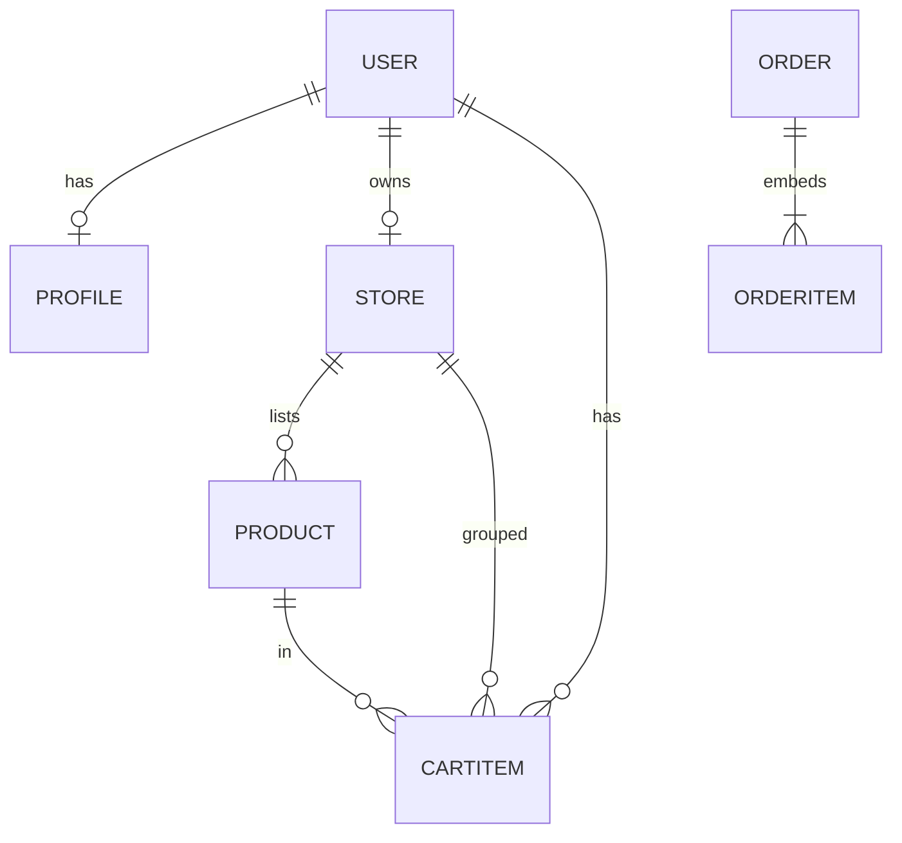

# 3.6 — Embedding vs referencing

<BigWordAlert term="Embedding vs referencing" plainEnglish="Embedding copies related data inside a document; referencing stores an ID and looks up the other collection." whyItMatters="Cart line items embed product snapshots; stores reference vendor users — each choice affects read speed and updates." />

## What you'll learn

By the end of this chapter, you'll be able to:

- Explain the difference between **reference** and **embed** with real examples
- Use a 4-question framework to decide which to use
- Apply the right choice to every FreshMarket entity
- Avoid the two most common MongoDB modelling mistakes

<Callout type="info" title="Why this matters">
Embed vs reference is the **most common MongoDB beginner mistake**. Cart items should **point at** live products; order lines should **copy** prices at purchase. Mixing those up gives customers wrong receipts.
</Callout>

<EntityDiagram title="FreshMarket ownership chain" chart={`
  USER ||--o{ STORE : owns
  STORE ||--o{ PRODUCT : lists
  USER ||--o{ ORDER : places
  STORE ||--o{ ORDER : fulfills
`} legend="ref = ObjectId string on the parent document; embed = snapshot copied at write time" />

## Two ways to relate data

MongoDB gives you two tools for connecting data:

### Reference — like a foreign key

Document A stores another document's `_id` and looks it up when needed:

```json
// Product document
{ "_id": "abc123", "name": "Basmati Rice", "storeId": "store456" }

// To get the store name, you "populate" or query separately
```

Use references when the related data has **its own lifecycle** and can be updated independently.

### Embed — copy inside the parent

Document A contains sub-objects inline:

```json
{
  "_id": "order789",
  "status": "pending",
  "orderItems": [
    { "nameAtPurchase": "Basmati Rice", "priceAtPurchase": 120, "quantity": 2 }
  ]
}
```

Use embeds when the data **belongs to one parent** and should stay frozen as a historical record.

## Think of it like…

**A shopping list vs a filed receipt.** The list (cart) says "2 kg rice from Stall A" and links to today's price board. The receipt (order) prints the exact price you paid — even if rice costs more next week. Reference the board while shopping; embed the numbers on the receipt.

## Decision framework — 4 questions

Ask these four questions for every relationship in your data:

1. **Does this data belong to one parent and rarely change independently?** → Embed candidate
2. **Does this data have its own lifecycle and many owners?** → Reference
3. **Must historical records stay frozen when source changes?** → Embed snapshot on the historical record
4. **Will unbounded growth blow document size?** → Reference or paginate embeds

MongoDB document limit: **16 MB** — far above a normal grocery order. Embedding order lines is safe.

## FreshMarket — the right choices

Applying the four questions to every relationship in the marketplace gives one clear answer per entity. Here is the full map you'll implement in Chapter 5:

| Entity | Strategy | Why |
|---|---|---|
| Profile → User | **Reference** | Profile updated independently; login stays lean |
| Store → User | **Reference** | Store is an entity vendors manage |
| Product → Store | **Reference** | Many products per store; store name not duplicated |
| CartItem → Product | **Reference** | Cart tracks **live** product; price read at checkout |
| Order → Customer, Store | **Reference** | Order belongs to customer and vendor |
| Order line items | **Embed** in Order | Snapshot at purchase — frozen prices |
| Product image | **Field on product** | URL string, not binary |

## Cart: reference live product

CartItem holds `productId` pointing to the current product document. Why?

- Vendor changes price → cart shows **current** price until checkout
- At checkout, you **copy** snapshot fields onto order lines
- `storeId` on cart item helps group by vendor without extra lookups

## Order: embed snapshot lines

At checkout, for each cart line you **read** current product fields, then **write** embedded objects on the order:

| Field | Source at checkout |
|---|---|
| `nameAtPurchase` | product.name now |
| `priceAtPurchase` | product.price now |
| `unitAtPurchase` | product.unit now |
| `quantity` | cart quantity |

After checkout, vendor changes product price → embedded fields **unchanged**. Customer history reads embedded array only.

<Callout type="warning" title="Anti-pattern">
```json
"orderItems": [{ "productId": "...", "quantity": 2 }]
```
This is wrong. Display history uses live product price — wrong receipt. Always include snapshot fields.
</Callout>

## Anti-pattern: embed everything

```json
"stores": { "products": [ /* thousands */ ] }
```

**Failure:** 16MB risk; loading store loads entire catalog. **Products live in their own collection** with `storeId` ref.

## Diagram — relationships



`ORDERITEM` embedded — not a separate collection.

## ✅ Do / ❌ Don't

**✅ Do:** Draw embedded box inside `orders` for line items with snapshot fields listed.

**✅ Do:** Draw refs as arrows with `ObjectId` label.

**❌ Don't:** Embed cart lines inside user document — cart changes often, separate collection cleaner.

**❌ Don't:** Reference-only order lines without snapshot fields.

<ChapterRecap id="01M34MR8GE1ZPGWAK3W9EW48Q4" />

## Self-check

- [ ] I can classify product→store and cart line→product as reference or embed, and why
- [ ] I can explain why order lines embed a snapshot but cart lines only reference
- [ ] I know the 16MB limit matters for embedded catalogues, not order lines

**Next:** Mandatory reading — MongoDB's data modelling docs before you draft the ERD.
<RealWorldEvent title="Walmart's polyglot data strategy" when="2010s–present" summary="Large retailers run multiple database technologies — relational systems for transactions and accounting, document or search stores for catalogs and recommendations." lesson="Choosing MongoDB for FreshMarket is a domain-driven decision. Document the trade-off so future you can defend it in an interview." />
