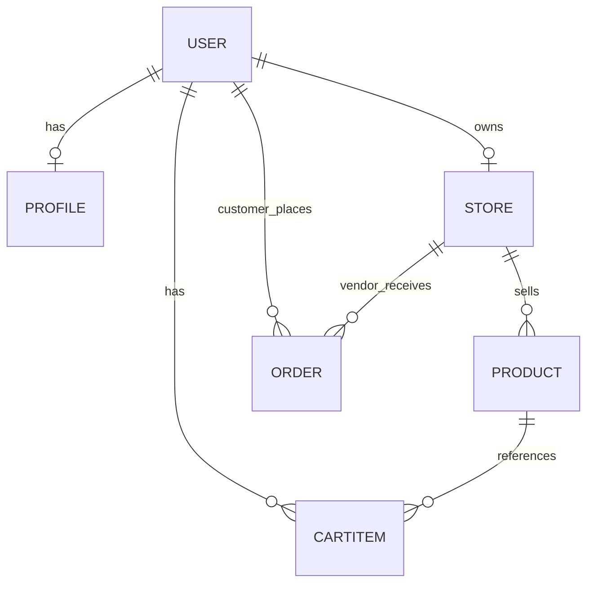

# 3.8 — Design your data blueprint

**Why this step matters:** This file is the blueprint Chapter 5 implements. Committing `erd-draft.md` now prevents schema improvisation later and forces embed-vs-reference decisions before Mongoose code exists.

<BigWordAlert term="Entity-relationship draft" plainEnglish="A diagram or doc listing entities, fields, and how they link — your schema before code." whyItMatters="FreshMarket's ERD catches missing ownership rules early — e.g. who can edit which store." />

**Where the project is now:** The project is an Express + React skeleton with `GET /health` returning 200 (Chapter 2). MongoDB is a choice on paper — no database running, no models, no schema decisions written down yet.

**After this step:** `docs/erd-draft.md` exists in your repo with a diagram, a collection inventory, and an embed-vs-reference audit for every relationship — committed to Git before any code is written.

<Callout type="info" title="Concept chapters must touch your repo">
This is **applied work** — the concept chapter touching your real repo (Rule 23, 28). When Chapter 5 asks for `unit` enum on Product, you open **your** ERD instead of guessing.
</Callout>

## What you must produce

Create **`docs/erd-draft.md`** in your marketplace repo (not the course guides folder).

### Minimum sections

#### 1. Title and date

```markdown
# ERD Draft — [Your Product Name]
Author: [you]
Date: [today]
Status: Draft before Chapter 5 implementation
```

#### 2. Diagram

Include **one visual** — any of:

- Mermaid `erDiagram` in the markdown file
- Screenshot of Excalidraw / dbdiagram.io
- ASCII diagram
- Photo of paper sketch

The diagram must show: users, profiles, stores, products, cartitems, orders, and embedded orderItems.

#### 3. Collection inventory table

| Collection | Purpose | Key fields |
|---|---|---|
| users | login identity | email, passwordHash, role |
| profiles | display info | userId ref, displayName |
| stores | vendor shop | userId ref, name, address |
| products | listings | storeId ref, name, price, unit, stockQty, isPerishable |
| cartitems | shopping cart | userId, productId, storeId, quantity |
| orders | checkout result | customerId, storeId, status, orderItems[] embedded |

#### 4. Embed vs reference audit

Short paragraph per relationship explaining **embed or ref** using vocabulary from 3.6.

## Starter Mermaid



Add embedded orderItems in prose below diagram:

> *Each ORDER document contains an embedded array `orderItems` with nameAtPurchase, priceAtPurchase, unitAtPurchase, quantity, productId.*

## Common mistakes

| Mistake | Fix |
|---|---|
| Single `users` blob with profile + store | Split collections |
| Order lines only `productId` | Add snapshot fields |
| No `storeId` on cart | Add for multi-vendor |
| Products embedded in store | Separate products collection |

## Verify checklist

- [ ] `docs/erd-draft.md` exists with title, author, date, status
- [ ] One visual diagram shows users, profiles, stores, products, cartitems, orders, orderItems
- [ ] Collection inventory table covers all six collections with purpose and key fields
- [ ] Embed-vs-reference decision written for each relationship using 3.6 vocabulary
- [ ] Embedded order lines documented with snapshot fields
- [ ] Committed to Git

## Commit

```bash
git add docs/erd-draft.md
git commit -m "docs: add ERD draft before schema implementation"
```

<ChapterRecap id="01M34MR8H9CQQG6WPMGFGNMWYQ" />

**Next:** Map actors to collections — who reads and writes what.
<RealWorldEvent title="Walmart's polyglot data strategy" when="2010s–present" summary="Large retailers run multiple database technologies — relational systems for transactions and accounting, document or search stores for catalogs and recommendations." lesson="Choosing MongoDB for FreshMarket is a domain-driven decision. Document the trade-off so future you can defend it in an interview." />
