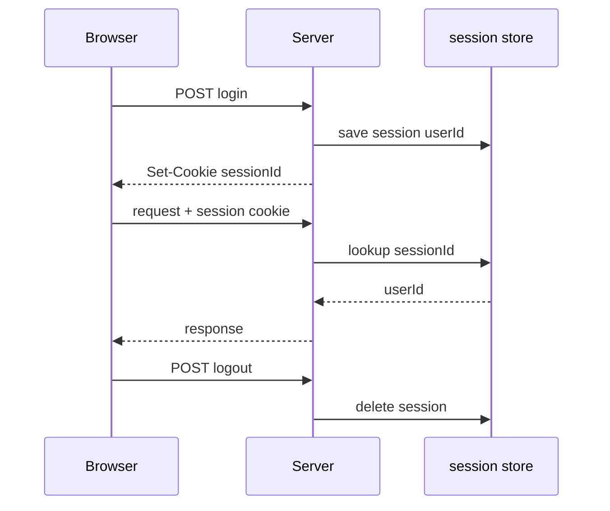
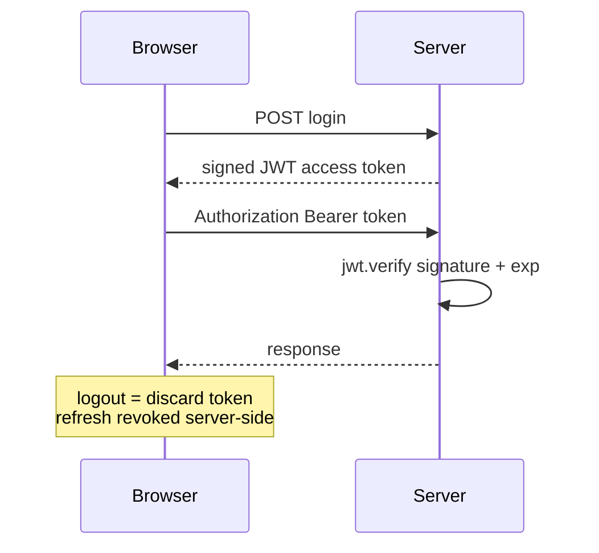

Every authenticated API must answer: **how does the server remember who sent this request?** Two dominant patterns — **server-side sessions** and **JWT (JSON Web Tokens)**. This course mandates JWT for FreshMarket.

<BigWordAlert term="Stateless JWT" plainEnglish="A signed token the client sends on each request — server validates signature without storing session in memory." whyItMatters="FreshMarket uses JWTs so the API scales without a central session store — good fit for a Node + React split." />

## Why this matters for absolute beginners

Sessions and JWT are not interchangeable labels — they change **where state lives** (server store vs signed token), how logout works, and how SPAs send credentials. Picking one without understanding the other leads to "why doesn't logout kill access instantly?" confusion. This course picks JWT + hashed refresh — know what you traded vs Redis sessions.

## Think of it like…

**Hand stamp vs driver's license at a festival.** Session: venue keeps a list at the door, you show a wristband number. JWT: you carry a signed pass with expiry printed on it — gate staff verify signature, not a lookup list (until refresh revocation).

<ComparePanel title="Sessions vs JWT">
  <CompareColumn label="Sessions">
    Server stores session in Redis/DB. Client holds session cookie. Logout deletes server-side session immediately. Requires session store at scale.
  </CompareColumn>
  <CompareColumn label="JWT (this course)">
    Server signs token; client sends Bearer header. Logout revokes refresh token. No central session lookup per request — scales horizontally.
  </CompareColumn>
</ComparePanel>

## Common beginner questions

<FaqGroup>

<FaqItem question={"Are JWTs encrypted?"}>

No — they're *signed*, which is a different thing. Anyone with a token can decode the payload and read its contents (paste one into jwt.io to see). What they can't do is change it, because the signature only verifies if the payload is untouched. So never put secrets, passwords, or anything sensitive in a JWT — treat the payload as public and use the signature only as tamper-evidence.

</FaqItem>

<FaqItem question={"Why short access token if refresh exists?"}>

To limit the blast radius of a leak. The access token is what the browser keeps in memory and sends with every request, so it's the most likely thing for a script to steal. If it's short-lived (say 15 minutes), a stolen token becomes useless almost immediately. The refresh token lives somewhere safer — an httpOnly cookie — and can be revoked server-side, which is why it can afford a long lifetime.

</FaqItem>

<FaqItem question={"Why not sessions with Express default memory store?"}>

For this course, two reasons. First, the default memory store keeps sessions in the server's RAM, so a second server process doesn't know about them — that falls over the moment you restart or scale. Second, the SPA + Bearer token pattern is what the rest of the course (and most real MERN apps) uses, so teaching that pattern here sets you up for the chapters ahead. Sessions are fine for tiny apps; they're just not the pattern this course is built on.

</FaqItem>

</FaqGroup>


## Server-side sessions



```
Login → server stores session in Redis/DB → returns session ID cookie
Each request → server looks up session → loads user
Logout → delete session server-side
```

| Pros | Cons |
|---|---|
| Instant revoke — delete session | Stateful — needs session store |
| Small cookie — just session id | Horizontal scaling needs shared store |
| Server controls lifetime tightly | Extra infra (Redis) for sessions at scale |

Classic choice for monolithic apps with server-rendered pages.

## JWT (stateless access token)



```
Login → server signs JWT with secret → client stores token
Each request → client sends Bearer token → server verifies signature + expiry
Logout → client discards token; server may revoke refresh only
```

| Pros | Cons |
|---|---|
| No session DB lookup per request | Hard to revoke access token before expiry |
| Works across microservices | Payload visible if not encrypted (signed, not secret) |
| Mobile/SPA friendly | Secret rotation requires care |

**Hybrid used here:** Short-lived JWT access + long-lived refresh stored hashed in DB — revoke refresh kills renewal.

## Why JWT for this course

| Factor | FreshMarket choice |
|---|---|
| MERN SPA client | Bearer token in memory fits React |
| Module monolith | No separate session Redis until Ch 21 cache |
| Learning goal | Industry-standard JWT + refresh pattern |
| Pair with Ch 7 | 401 refresh loop teaches real client auth |

Redis in Chapter 21 is for **catalogue cache**, not sessions.

## What goes in JWT payload

**Include:**

- `sub` or `userId` — MongoDB User _id  
- `role` — vendor | customer  
- `iat`, `exp` — issued/expiry  

**Never include:**

- passwordHash  
- email (optional — prefer /me endpoint)  
- refresh token inside access token  

Keep access payload minimal — reduces leakage if token stolen.

## Refresh token pattern

The two tokens do very different jobs — one proves you're still logged in for minutes, the other proves you're still logged in for days:

| | Access JWT | Refresh token |
|---|---|---|
| Lifetime | 15 minutes | 7 days |
| Sent how | Authorization header | httpOnly cookie (Ch 7) or body (Ch 6 curl) |
| Stored server | Not stored | Hash in User.refreshTokenHash |
| Revoke | Wait for expiry | Clear hash on logout / rotation |

**Rotation (recommended):** New refresh on each refresh call — invalidate old hash.

## Comparison table

Side by side, the practical differences that matter on a real codebase:

| Concern | Sessions | JWT access + refresh |
|---|---|---|
| Revoke all sessions | Easy | Clear refresh hashes; access until expiry |
| DB hit per request | Yes (lookup) | No for access verify |
| XSS steals token | Session cookie httpOnly | Access in memory reduces XSS vs localStorage |
| CSRF | Cookie session risk | Bearer header less CSRF on API |

## Decision record

Document in learning log:

*"FreshMarket uses JWT access tokens verified with JWT_SECRET and refresh tokens hashed on User. Access is stateless; refresh revocation provides logout. Session store deferred."*

## ✅ Do / ❌ Don't

**✅ Do:** Keep access lifetime short — 15m default.

**✅ Do:** Hash refresh token before DB storage — like passwords.

**❌ Don't:** Put JWT_SECRET in git or client.

**❌ Don't:** Store access token in localStorage if avoidable — Ch 7 uses memory.

<RealWorldEvent title="Auth0 breach response reshapes token hygiene" when="2023" summary="High-profile auth incidents pushed teams to shorten token lifetimes, rotate secrets, and treat refresh flows as first-class security surfaces." lesson="Build OTP verification and refresh rotation now so auth is production-shaped before real customer data exists." />

## Reflect

<OpenQuestion id="01M34MR921KR14463HQEY0WNNG" />


## Next

**Sub-chapter 6.5:** Password hashing — bcrypt, salt, cost factor.

Architecture chosen — password storage mechanics next.
