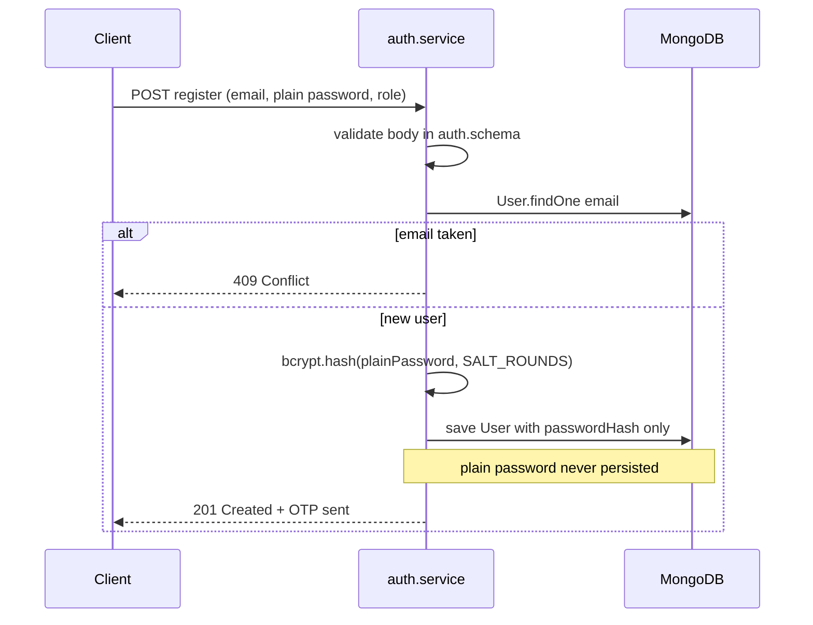
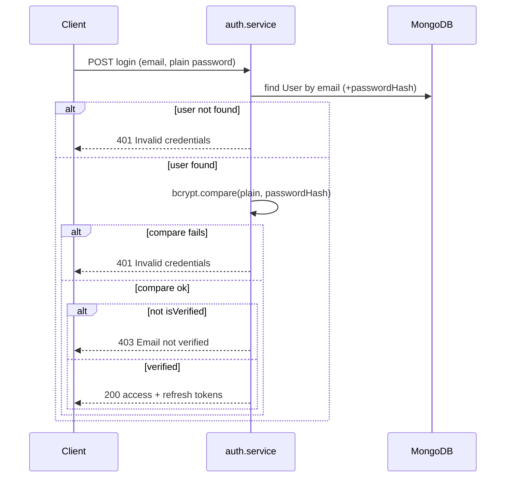

Plain text passwords in a database are a firing offence. **Hashing** is one-way — you verify login by comparing bcrypt output, never by decoding. This sub-chapter specifies bcrypt usage for register and login in auth.service.

<BigWordAlert term="Password hashing" plainEnglish="One-way scrambling of passwords before storage so a database leak does not expose raw passwords." whyItMatters="You never store or log plaintext passwords — bcrypt turns them into verifiable but irreversible hashes." />

## Why this matters for absolute beginners

If you can "get the password back" from the database, you did it wrong. Hashing is one-way — login compares with `bcrypt.compare`, never `===` on plain text. MongoDB backups, leaked dumps, and insider access happen; bcrypt turns a catastrophe into slow guessing. This is non-negotiable professional hygiene, not an advanced option.

## Common beginner questions

<FaqGroup>

<FaqItem question={"bcrypt vs bcryptjs?"}>

They're the same algorithm — bcrypt — implemented twice. The native `bcrypt` package is a compiled binding, so it's faster, but it has to build against your OS and can occasionally fail to install. `bcryptjs` is pure JavaScript, slower but with zero native dependencies, so it installs everywhere. Either one is correct, and both expose the same `hash` and `compare` API. Pick native `bcrypt` first; fall back to `bcryptjs` if the install gives you trouble.

</FaqItem>

<FaqItem question={"Should I hash in Mongoose pre-save hook?"}>

You can, but this course keeps it in the service layer for a reason. A pre-save hook fires on *every* save of a User — including updates that should never re-hash anything — and it's one more place to get the ordering wrong. With hashing in the auth service, there's exactly one trusted place that register and login both go through, and you can see it happen in the code. Consistency beats cleverness here.

</FaqItem>

<FaqItem question={"Seed users have passwords before bcrypt — now what?"}>

Once your User model stores `passwordHash` instead of plain text, the old seeded documents don't have one, so their login breaks. Fix it by re-running the seed *after* you implement hashing — and make the seed script hash the test password too. Document the test credentials in the README, something like `vendor-a@test.local` / `Password123!`. The goal is that every seeded user can log in through the real bcrypt path, exactly like a real user.

</FaqItem>

<FaqItem question={"What is `select: false` on passwordHash?"}>

It's a Mongoose setting that says "don't include this field in query results by default." So when your code returns a user's JSON for something like the `/me` endpoint, the hash doesn't leak into the response by accident. Login still needs the hash, so the login query explicitly asks for it with `.select('+passwordHash')`. Think of it as a safety net: the hash only appears where you deliberately fetch it.

</FaqItem>

</FaqGroup>


## Hash + salt + bcrypt

| Term | Meaning |
|---|---|
| Hash | One-way function — cannot recover password |
| Salt | Random per-password input — defeats rainbow tables |
| bcrypt | Adaptive hash — cost factor slows brute force as hardware improves |

Node library: **`bcrypt`** (or bcryptjs — pure JS, slower; bcrypt native preferred).

## Register flow (spec)



```
1. Validate email, password, role in auth.schema
2. Check email not taken — User.findOne({ email })
3. hash = await bcrypt.hash(plainPassword, SALT_ROUNDS)
4. Save User with passwordHash = hash
5. Never persist plainPassword
```

**SALT_ROUNDS:** 10–12 for dev — document constant in auth.service or config.

## Login flow (spec)



```
1. Find User by email — generic error if not found (don't leak existence optional debate)
2. await bcrypt.compare(plainPassword, user.passwordHash)
3. If false → 401 Invalid credentials
4. If !user.isVerified → 403 Email not verified
5. Issue tokens
```

Use **same error message** for wrong email vs wrong password if avoiding user enumeration — course accepts either explicit or generic.

## What never happens

These anti-patterns all look like reasonable shortcuts — and each one is how real passwords leak:

| Anti-pattern | Why forbidden |
|---|---|
| `password === user.password` | Plain text |
| MD5/SHA256 alone | Too fast — crackable |
| Encrypt password with decrypt key | Reversible |
| Log req.body.password | Leak in log aggregators |
| Return passwordHash in JSON | Leak in network tab |

## Seed data alignment

Re-run seed **after** bcrypt implemented — or update seed to bcrypt.hash known test password.

Document in README:

```
Test login: vendor-a@test.local / Password123!
```

## bcrypt.compare timing

bcrypt.compare is constant-time enough for practical purposes — prefer over manual hash recompute.

## Optional User schema hardening

```javascript
passwordHash: { type: String, required: true, select: false }
```

`select: false` — User.findOne(&#123; email &#125;) must `.select('+passwordHash')` for login.

Document if you adopt — prevents accidental hash in /me response.

## Config consideration

Two knobs control how hashing behaves — keep them in one obvious place:

| Setting | Location |
|---|---|
| SALT_ROUNDS | auth.service constant or env BCRYPT_ROUNDS |
| Min password length | auth.schema — 8 chars |

## ✅ Do / ❌ Don't

**✅ Do:** Hash in service layer — not in Mongoose pre-save unless consistent everywhere.

**✅ Do:** Verify seed users login after hash migration.

**❌ Don't:** Send password in query string — POST body only.

**❌ Don't:** Lower bcrypt rounds below 10 for convenience.

<RealWorldEvent title="Auth0 breach response reshapes token hygiene" when="2023" summary="High-profile auth incidents pushed teams to shorten token lifetimes, rotate secrets, and treat refresh flows as first-class security surfaces." lesson="Build OTP verification and refresh rotation now so auth is production-shaped before real customer data exists." />

## Reflect

<OpenQuestion id="01M34MR92GMH98VG92Z580J96Q" />


## Next

**Sub-chapter 6.6:** What a JWT is — header, payload, signature; role in token.

Passwords handled — token format next.
