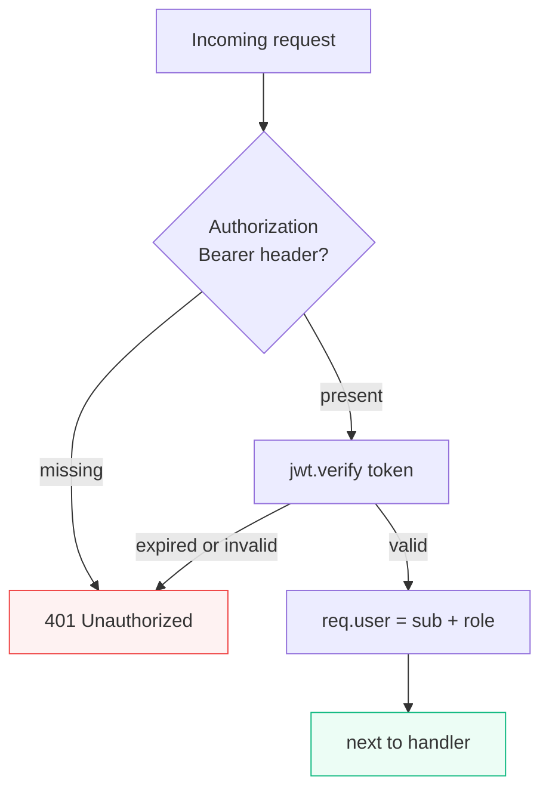

**Why this step matters:** `requireAuth` turns anonymous HTTP into identified requests — every later ownership check starts with `req.user` from a **verified** JWT, not client-supplied ids. `/api/auth/me` is your smoke test before store and product routes use the same guard.

<BigWordAlert term="Auth middleware" plainEnglish="Express middleware that validates JWT, attaches user to request, or returns 401 before the handler runs." whyItMatters="Every protected FreshMarket route uses the same middleware — no copy-pasted token parsing." />

**Where the project is now:** Tokens issued; protected routes still open or unguarded.

**After this step:** `requireAuth` middleware verifies Bearer access JWT, attaches `req.user`, returns **401** on missing/invalid/expired token. `GET /api/auth/me` uses it.

## requireAuth specification

**Input:** Header `Authorization: Bearer <accessToken>`

**Success:** `req.user = { id: string, role: 'vendor' | 'customer' }`

**Failure:** 401 JSON `{ message: 'Unauthorized' }` — stop chain

## Middleware behaviour (implement in auth.middleware.js)



```
1. Read Authorization header
2. If missing or not Bearer prefix → 401
3. Extract token string
4. try jwt.verify(token, config.jwtSecret)
5. catch TokenExpiredError → 401
6. catch JsonWebTokenError → 401
7. req.user = { id: payload.sub, role: payload.role }
8. next()
```

Do not call next() after sending 401.

## GET /api/auth/me

**Auth:** requireAuth

**Success 200:**

```json
{
  "user": {
    "id": "...",
    "email": "vendor-a@test.local",
    "role": "vendor",
    "isVerified": true
  },
  "profile": {
    "displayName": "Vendor A",
    "phone": null,
    "avatarUrl": null
  }
}
```

Load User + Profile by req.user.id — exclude passwordHash.

## curl verify

<ApiRequestPanel title="Auth middleware">

<ApiRequest
  label="GET /api/auth/me — valid token"
  method="GET"
  url="http://localhost:5000/api/auth/me"
  bearer="<access-token-from-login>"
  responseStatus={200}
  responseBody='{"user":{"email":"vendor-a@test.local","role":"vendor"},"profile":{"displayName":"Vendor A"}}'
/>

<ApiRequest
  label="GET /api/auth/me — no token"
  method="GET"
  url="http://localhost:5000/api/auth/me"
  responseStatus={401}
  responseBody='{"message":"Unauthorized"}'
/>

<ApiRequest
  label="GET /api/auth/me — invalid token"
  method="GET"
  url="http://localhost:5000/api/auth/me"
  bearer="badtoken"
  responseStatus={401}
  responseBody='{"message":"Unauthorized"}'
/>

</ApiRequestPanel>

Expect 200 with user + profile when token is valid.

## Export pattern

Other modules import requireAuth:

```
import { requireAuth } from '../auth/auth.middleware.js'
router.get('/vendor/products', requireAuth, ...)
```

Chapter 8 adds requireRole after requireAuth.

## 401 vs 403 distinction

| Code | Meaning | This chapter |
|---|---|---|
| 401 | Not authenticated — bad/missing token | requireAuth |
| 403 | Authenticated but not allowed | requireRole Ch 8; unverified login 403 in service |

requireAuth never returns 403 — only 401.

## Commit

```bash
git add server/src/modules/auth/
git commit -m "feat(auth): add requireAuth middleware and GET /me"
```

## ✅ Do / ❌ Don't

**✅ Do:** Attach minimal req.user — id + role only.

**✅ Do:** Use requireAuth on /me before shipping Ch 7.

**❌ Don't:** Trust X-User-Id header from client.

**❌ Don't:** Return stack traces on verify failure.

## Verify checklist

- [ ] Valid token → /me 200
- [ ] Missing token → 401
- [ ] Invalid token → 401
- [ ] req.user.role matches JWT payload
- [ ] passwordHash never in /me response

<RealWorldEvent title="Auth0 breach response reshapes token hygiene" when="2023" summary="High-profile auth incidents pushed teams to shorten token lifetimes, rotate secrets, and treat refresh flows as first-class security surfaces." lesson="Build OTP verification and refresh rotation now so auth is production-shaped before real customer data exists." />


## Before you continue

<OpenQuestion id="01M34MR97793CVTYC7TQBAMEK4" />

## Next

**Sub-chapter 6.18:** Test with curl — full register → verify → login → refresh → me flow.

Middleware done — end-to-end curl script next.
