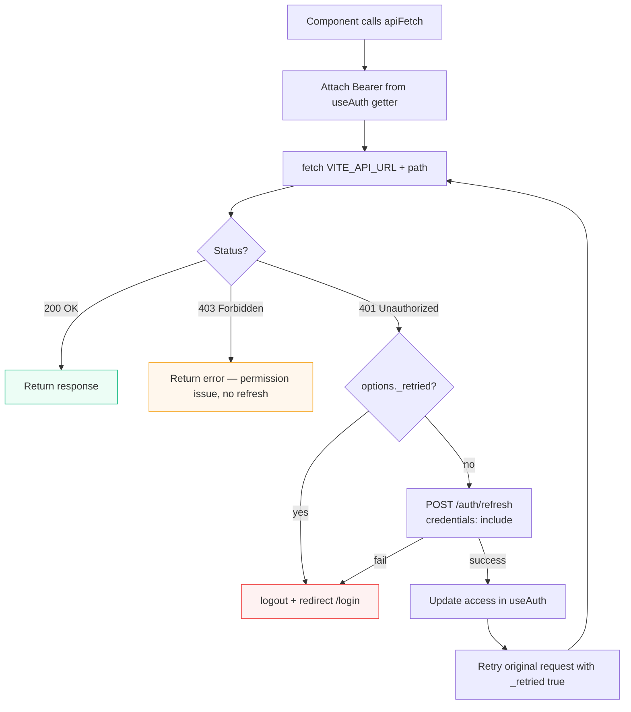
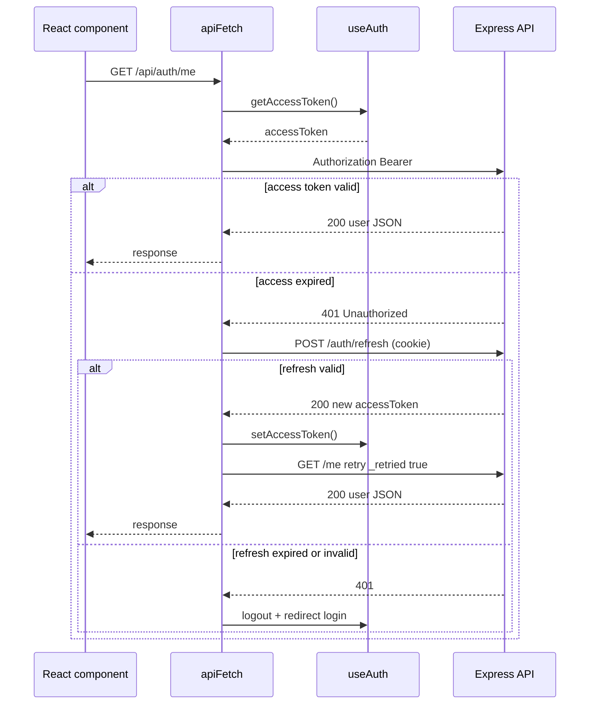
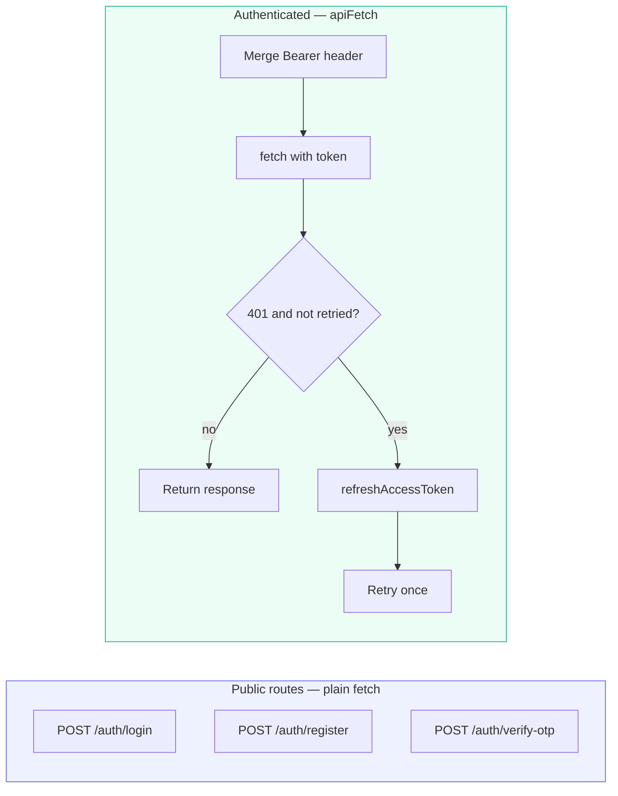

**Why this step matters:** Manually attaching Bearer tokens on every fetch does not scale — one interceptor adds auth headers and runs the 401 refresh loop so expired access feels invisible to users shopping the marketplace.

<BigWordAlert term="Request interceptor" plainEnglish="Middleware in the API client that attaches Authorization header to every outgoing request automatically." whyItMatters="FreshMarket components call `api.get('/cart')` without manually adding tokens — interceptor handles it." />

**Where the project is now:** Login sets token manually per call; no centralized auth header or refresh.

**After this step:** `client/src/api/client.js` exports authenticated `apiFetch` (or axios equivalent) that attaches Bearer, handles 401 refresh once, retries, credentials on refresh.

## Why one interceptor instead of per-page headers

In a real SPA, dozens of components call the API — cart, products, orders, profile. Without a central client:

| Approach | Problem at scale |
|---|---|
| Manual `Authorization` on every fetch | Forgotten on one call → mysterious 401 in production |
| Copy-paste wrapper in each page | Refresh logic diverges; one page infinite-loops |
| Axios instance with interceptors | **Industry pattern** — one place for auth + retry |

Chapter 7.5 defined the algorithm. This step **implements** it once so every future chapter reuses `apiFetch` — vendor dashboard, shop browse, checkout all inherit silent refresh automatically.

<TraceRequest title="401 refresh loop">
  <TraceStep actor="React" label="GET /api/auth/me" detail="Attach Bearer from useAuth getter" />
  <TraceStep actor="API" label="401 Unauthorized" status={401} />
  <TraceStep actor="React" label="POST /auth/refresh" detail="credentials: include — httpOnly cookie" />
  <TraceStep actor="API" label="200 new accessToken" status={200} />
  <TraceStep actor="React" label="Retry GET /api/auth/me" detail="_retried: true on options" />
  <TraceStep actor="API" label="200 user JSON" status={200} />
</TraceRequest>

## Request flow (implements 7.5)





<Callout type="warning" title="Login 401 is not expired token">
Wrong password on `/api/auth/login` returns 401 — **do not** run refresh there. Exclude public auth routes from the interceptor (listed below). Refresh is only for expired access on **authenticated** calls.
</Callout>

## Module API contract

Extend existing client from Ch 2:

| Export | Purpose |
|---|---|
| `getHealth()` | unchanged — no auth |
| `apiFetch(path, options)` | authenticated requests |
| `setAuthTokenGetter(fn)` | called from AuthProvider |
| `setOnUnauthorized(fn)` | logout redirect hook |

## apiFetch behaviour



```
1. Merge headers Authorization Bearer if token available
2. fetch VITE_API_URL + path
3. if status === 401 && !options._retried:
     await refreshAccessToken()  // POST /api/auth/refresh credentials include
     if success: retry with _retried true
     else: onUnauthorized()
4. return Response or parsed JSON helper
```

## Refresh helper

```
POST /api/auth/refresh
credentials: 'include'
Body empty if cookie-only mode
On 200: update access via auth module callback
```

Coordinate with useAuth — avoid circular imports (token getter injection pattern).

## Routes excluded from interceptor refresh

Do not attach Bearer or refresh on:

- /api/auth/login  
- /api/auth/register  
- /api/auth/verify-otp  

Use plain fetch for those in useAuth.

## Server CORS update

Ensure server allows credentials from Vite origin — required for cookie refresh.

## Common mistakes

| Mistake | Symptom | Fix |
|---|---|---|
| Refresh on login 401 | Wrong password triggers refresh loop | Exclude `/auth/login` from interceptor |
| No `_retried` flag | Infinite 401 → refresh → 401 loop | Retry original request at most once |
| Refresh on 403 | Vendor hits customer-only route → logout | Only 401 triggers refresh — 403 is permission (Ch 8) |
| Token in client.js module state | Stale token after login | Inject getter from useAuth via `setAuthTokenGetter` |
| Missing `credentials: 'include'` | Refresh always 401 — cookie never sent | Add on refresh fetch and authenticated calls |
| Circular import useAuth ↔ client | Build fails or undefined hook | Token getter injection pattern (see 7.10) |

## Test

1. Login  
2. Call GET /api/auth/me via apiFetch  
3. Confirm Authorization header in network tab  

Temporary: set short access expiry — confirm refresh + retry in network tab.

## Commit

```bash
git add client/src/api/client.js client/src/hooks/useAuth.js
git commit -m "feat(client): add api interceptor with 401 refresh retry"
```

## ✅ Do / ❌ Don't

**✅ Do:** Single retry flag per request chain.

**✅ Do:** Parse JSON errors consistently for UI.

**❌ Don't:** Refresh on login 401 wrong password.

**❌ Don't:** Store tokens in api/client module long-term — getter from useAuth.

## Verify checklist

- [ ] apiFetch sends Bearer when logged in
- [ ] /me works via apiFetch
- [ ] 401 triggers refresh + retry (manual or short expiry test)
- [ ] credentials include on refresh

<RealWorldEvent title="GitHub's session and token evolution" when="2010s–present" summary="Developer platforms refined PATs, OAuth apps, and session handling as users demanded security without constant re-authentication." lesson="Treat the client auth layer as part of security design, not a UI afterthought — refresh logic belongs in one place, not scattered across pages." />


## Before you continue

<OpenQuestion id="01M34MR9E954CPAJ44WEX642AX" />

## Next

**Sub-chapter 7.15:** ProtectedRoute wrapper.

Interceptor done — route guards next.
