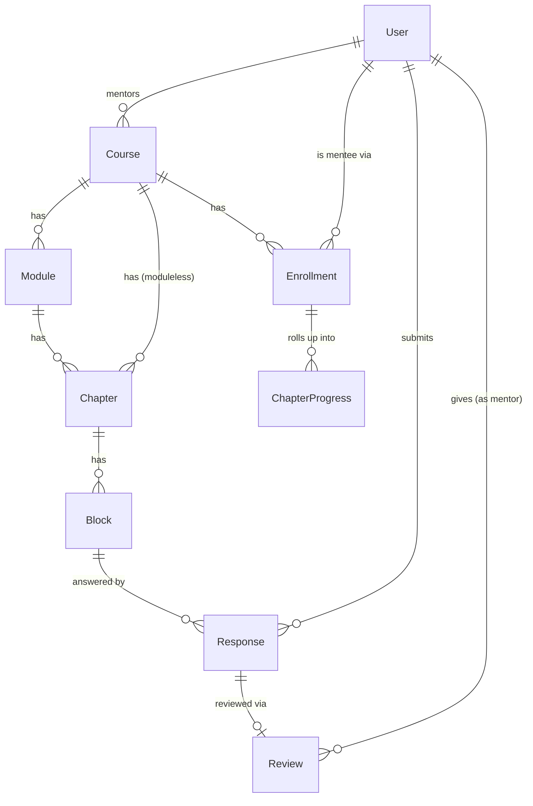

# Product overview

**Reads:** none — this is the entry point into the product docs.

## One-sentence pitch

> A mentor writes a course in Markdown, drops in interactive blocks, assigns it to their students,
> and gets a live dashboard of exactly who understood what.

## The core bet

Passive reading does not teach; forced interaction does. Every chapter mixes explanation with
checkpoints — quizzes, MCQ tests, required-reading acknowledgements, open-ended written answers,
and runnable code. The platform tracks every interaction and turns it into reports the mentor can
act on.

## Non-goals for v1

- Video hosting / streaming (link out to YouTube/Loom if needed).
- Live classes, scheduling, calendars.
- Payments, marketplace, public course catalog.
- Mobile apps (responsive web only).
- Certificates, gamification, leaderboards.

See [`10-deferred-v2.mdx`](10-deferred-v2.mdx) for things that are in-scope conceptually but
explicitly pushed to v2.

## Users and roles

| Role | What they do |
|---|---|
| **Mentor** (author + instructor) | Creates courses, writes chapters, defines interactive blocks, assigns courses to mentees, reviews open-ended answers, reads reports. |
| **Mentee** (learner) | Enrolls / is assigned, reads chapters, answers blocks, runs code, submits work, sees own progress. |
| **Admin** | Manages users, promotes mentors, sees platform-wide data. Thin role in v1 — a superset of mentor. |

Roles are per-user and global in v1 (`role: MENTOR | MENTEE | ADMIN`). A user could in principle be
a mentor on one course and a mentee on another — the data model allows it (`Enrollment` is what
makes someone a mentee of a course) — but the v1 UI keeps the two experiences separate; there is no
role-switcher in the product.

## Entity relationships (high level)

Full definitions of each entity are in [`01-domain-model.mdx`](01-domain-model.mdx).

## Build order (why the reader and editor come first)

Screens, in build order: **chapter reader → MDX editor → mentee dashboard/course overview → review
queue → reports → mentee assignment → everything else.**

The reader and the editor are the product. Everything else — dashboards, assignment flows, reports
— is scaffolding that makes the core loop (write → assign → learn → review) usable at scale. See
[`docs/README.mdx`](README.mdx) for the phase-by-phase build plan this maps to.
